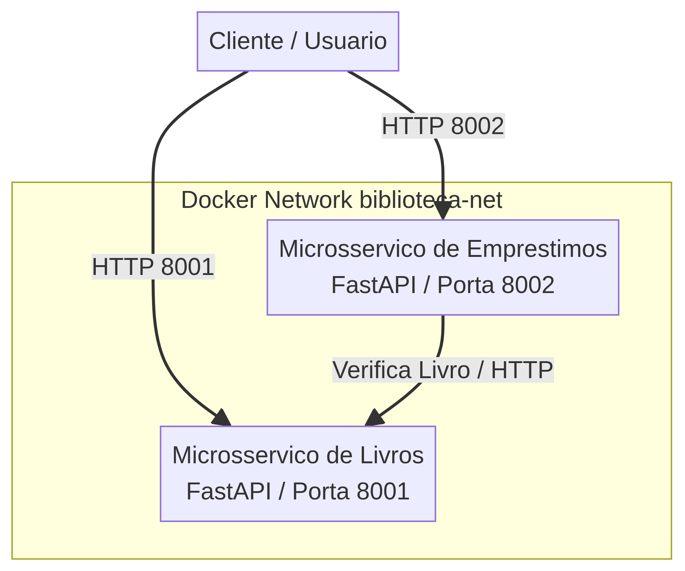
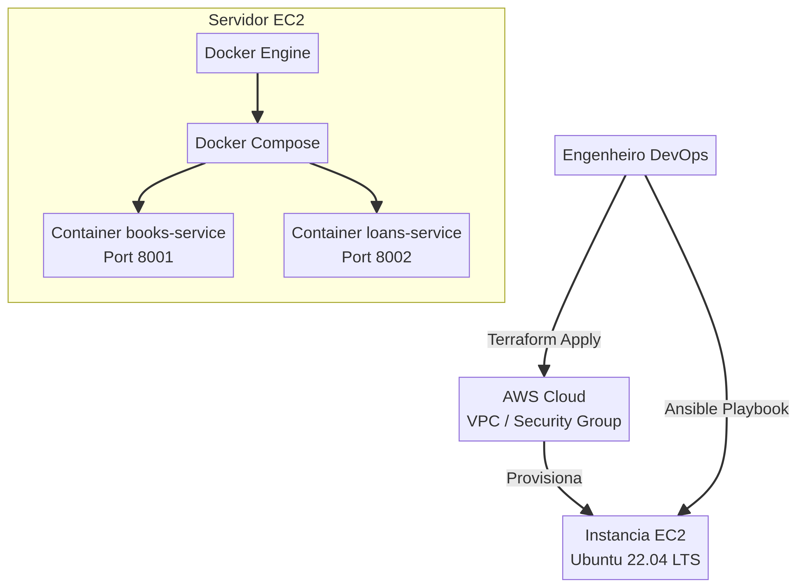

# Sistema da Biblioteca Escolar — Microsserviços, DevOps & Gerência de Configuração

Repositório oficial da solução desenvolvida para a **Atividade Integradora**, adotando a **Opção B (Dois Microsserviços)**. O projeto contempla arquitetura desacoplada em microsserviços, containerização via Docker, automação de infraestrutura com Terraform, gerência de configuração com Ansible, práticas de DevSecOps, diagramas e histórico de commits incrementais simulando os papéis da equipe.

---

## 1. Arquitetura da Solução (Opção B)

A aplicação foi dividida em dois microsserviços independentes desenvolvidos em Python (FastAPI):
1. **`books-service` (Porta 8001):** Gerencia o acervo (cadastro, consulta, alteração, exclusão e listagem de livros).
2. **`loans-service` (Porta 8002):** Gerencia o fluxo de circulação (registro de empréstimos, devoluções, histórico e consulta de empréstimos ativos), comunicando-se com o serviço de livros.

### Diagrama de Arquitetura


### Diagrama de Infraestrutura e Provisionamento


---

## 2. Estrutura do Repositório

```text
biblioteca-devops/
├── app/
│   ├── books/
│   │   ├── Dockerfile
│   │   ├── main.py
│   │   └── requirements.txt
│   └── loans/
│       ├── Dockerfile
│       ├── main.py
│       └── requirements.txt
├── terraform/
│   ├── main.tf
│   ├── variables.tf
│   └── outputs.tf
├── ansible/
│   ├── inventory.ini
│   └── instalar-biblioteca.yml
├── docker-compose.yml
├── docs/
│   ├── requisitos.md
│   ├── seguranca.md
│   ├── arquitetura.mmd
│   ├── arquitetura.png
│   ├── infraestrutura.mmd
│   └── infraestrutura.png
├── .gitignore
└── README.md
```

---

## 3. Tutorial Completo de Execução e Reprodução

Para colocar o sistema em funcionamento de maneira padronizada, reprodutível e automatizada, execute os comandos abaixo nas respectivas etapas:

### Passo 1: Provisionamento de Infraestrutura (Terraform)
Os recursos de nuvem (VPC, Security Groups restritos e instâncias EC2) são criados automaticamente pelo Terraform:
```bash
cd terraform
terraform init
terraform plan
terraform apply -auto-approve
```

### Passo 2: Configuração Automática do Servidor (Ansible)
Após obter o endereço IP público da instância EC2 provisionada, edite o arquivo `ansible/inventory.ini` substituindo `YOUR_SERVER_IP` pelo IP real e execute o playbook:
```bash
cd ../ansible
ansible-playbook -i inventory.ini instalar-biblioteca.yml
```

### Passo 3: Execução e Teste Local com Docker Compose
Para testar a stack completa localmente em containers Docker isolados:
```bash
cd ..
docker compose up -d --build
```
Os serviços estarão acessíveis em:
- **Microsserviço de Livros:** `http://localhost:8001/docs` (Swagger UI)
- **Microsserviço de Empréstimos:** `http://localhost:8002/docs` (Swagger UI)

### Passo 4: Teste de Reprodução e Limpeza
Para validar a idempotência e destruir o ambiente conforme exigido no teste de reprodução:
```bash
cd terraform
terraform destroy -auto-approve
```

---

## 4. Práticas de Segurança e DevSecOps

- **Confidencialidade:** Isolamento de rede via Docker Bridge e regras estritas de Security Group no Terraform.
- **Integridade:** Validação rígida de payloads de entrada com Pydantic e versionamento com rastreabilidade de commits.
- **Disponibilidade:** Política de reinicialização automática (`restart: always`) nos containers e automação idempotente com Ansible.

---

## 5. Histórico de Contribuições (Papéis da Equipe)

O desenvolvimento seguiu uma abordagem incremental com commits realizados cobrindo todos os papéis exigidos pela atividade:
- **Product Owner (PO):** Definição e priorização do Backlog da Opção B.
- **Analista de Requisitos:** Especificação funcional dos domínios de Livros e Empréstimos.
- **Scrum Master:** Organização da estrutura, diagramas e planejamento da entrega.
- **Desenvolvedor:** Implementação dos microsserviços em FastAPI, endpoints e Dockerfiles.
- **DevOps / DevSecOps:** Criação dos scripts Terraform, playbooks Ansible, compose e documentação de segurança.
